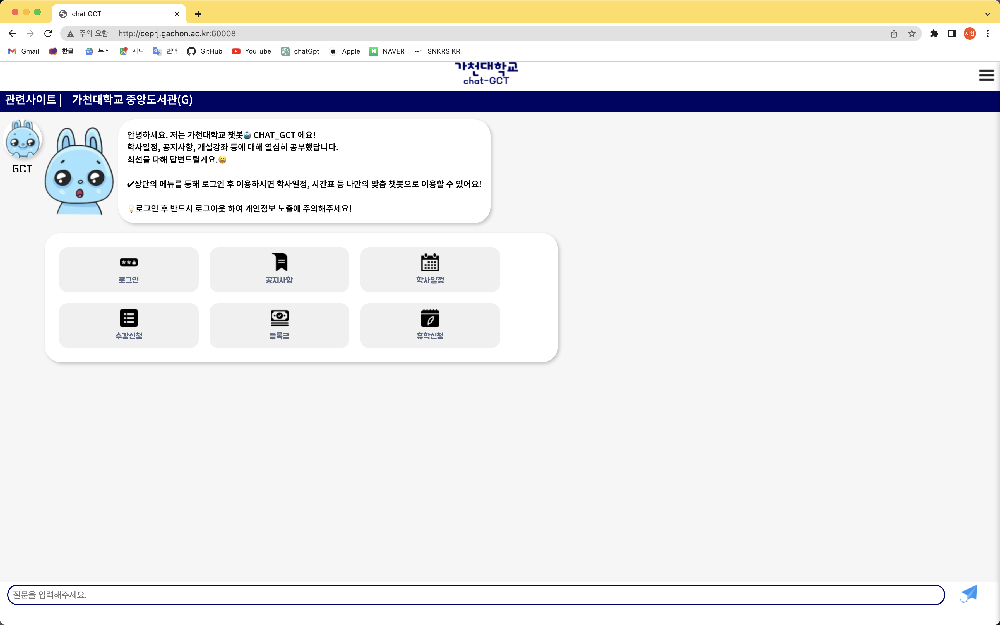

# 챗봇&시간표추천 웹사이트

이 웹사이트는 대학 공지사항에 대한 질문-응답 시스템과 개설 강좌 추천 서비스, 시간표 관리 시스템을 제공함.

### 미리보기

## 1. 프로젝트 목표 & 팀원 소개

### 프로젝트 목표

- 대학 공지 챗봇 프로젝트는 기존 챗봇들이 가지는 부정확성 문제를 해결하고, 학생들에게 더 신뢰성 있는 정보 제공 서비스를 제공하려고 함.
- 이 프로젝트는 구현 뿐만 아니라 클라우드 환경에서 애플리케이션을 CI/CD를 통해 배포하는 경험을 목표로 진행함.

### 팀원

- 양권상, 박상웅, 전병현, 전재환

## 2. 사용 기술

### DeepLearning

- Language: Python
- Model: bert

### Server

- Language: JavaScript
- Framework: Node.js/Express

### DB

- MySQL

### Deployment

- 학교 서버 이용

### Github Branch Management

- 브랜치 관리 전략은 Github Flow를 사용
- dev branch에서 작업, 완성물을 메인에 merge

## 3. 주요 기능

1. **질문-응답 시스템**: 사용자의 질문에 답변하기 위해 BERT 모델을 이용하여 학습된 대학 공지 데이터셋을 기반으로 하는 시스템입니다.
2. **개설 강좌 추천 서비스**: 사용자의 선호도 와 과목의 이수를 고려하여 개설 강좌를 추천해주는 시스템입니다.
3. **시간표 관리 시스템**: 개인 시간표를 관리할 수 있는 시스템입니다.

## 4. 데이터 파이프라인

## 5. 챗봇 모델 선정
  - 전체적으로 보았을 때 Bert-Multilingual 모델이 높은 성능을 보였지만, 특정 데이터셋에 대한 성능, 학습 및 실행 시간 등 다른 요인들을 고려하여 가장 적합한 모델을 선택하는 것이 중요함.

## 6. 실행화면

## 7. 프로젝트 소개 url
http://ceprj.gachon.ac.kr/inner-page-231#
